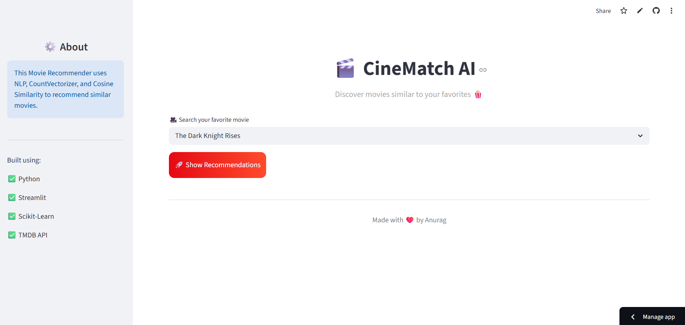
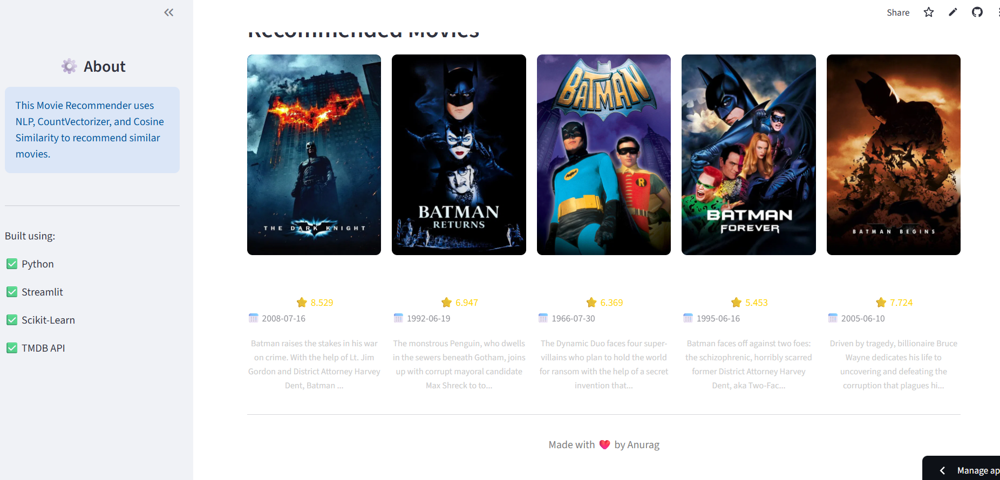

# 🎬 CineMatch AI — Movie Recommender System

A **Content-Based Movie Recommendation System** powered by Machine Learning and NLP that suggests movies similar to a selected title using text vectorization and cosine similarity.

Built with **Streamlit**, integrated with **TMDB API**, and designed with a Netflix-style UI for an interactive user experience.

---

# 🚀 Live Demo

👉  https://movie-recommender-system-69gsmwwnx4xrrt73guqyff.streamlit.app/#cine-match-ai

---

# 📸 Project Preview

### 🏠 Home Interface


### 🎯 Recommendations Output


---

# 💡 Problem Statement

With thousands of movies available on streaming platforms, users often struggle to find relevant content.

This project solves this by building a **smart recommendation engine** that suggests movies based on content similarity.

---

# ⚙️ How It Works (Simple Explanation)

Each movie is transformed into a **text-based feature vector** using metadata like:

- Genres  
- Keywords  
- Cast  
- Crew  
- Overview  

These are combined into a single **"tag" representation**.

Then similarity is calculated as:

:contentReference[oaicite:0]{index=0}

The system computes similarity between movies and recommends the closest matches.

---

# 🧠 Machine Learning Pipeline

- Data Collection (TMDB dataset)  
- Data Cleaning & Preprocessing  
- Feature Engineering (tags creation)  
- Text Vectorization (CountVectorizer)  
- Similarity Calculation (Cosine Similarity)  
- Recommendation Engine  
- Streamlit Deployment  

---

# 🛠️ Tech Stack

## 🧑‍💻 Frontend
- Streamlit  

## 🧠 Machine Learning
- Scikit-learn  
- NLP (Text Processing)  
- CountVectorizer  
- Cosine Similarity  

## 🌐 API Integration
- TMDB API (movie posters & metadata)  

## 📦 Libraries
- pandas  
- numpy  
- requests  
- pickle  
- sklearn  

---

# 📁 Project Structure

```text
movie-recommender-system/
│
├── app.py
├── movie_dict.pkl
├── movies.pkl
│
├── assets/
│   ├── homepage.png
│   ├── recommendation.png
│
├── requirements.txt
├── .gitignore
└── README.md

🚀 How to Run Locally
1. Clone the repository
git clone https://github.com/anuragsworld1-oss/movie-recommender-system.git
cd movie-recommender-system
2. Install dependencies
pip install -r requirements.txt
3. Run Streamlit app
streamlit run app.py
🎯 Key Features
🔍 Smart content-based recommendations
🎬 Movie posters via TMDB API
⚡ Fast and lightweight recommendation engine
🎨 Clean Netflix-style UI
📊 Scalable ML pipeline
🌐 Fully deployed Streamlit app
📊 Why This Project Stands Out

✔ Real-world recommendation system
✔ NLP + ML combined application
✔ End-to-end pipeline (data → model → UI)
✔ API integration (industry skill)
✔ Deployment-ready project

🔮 Future Improvements
🔥 Add Collaborative Filtering
⚡ Use FAISS for faster similarity search
🎥 Add YouTube trailer integration
👤 Add user login & watch history
🧠 Upgrade to deep learning embeddings (BERT)
📱 Mobile-responsive UI
📚 What I Learned
NLP preprocessing techniques
Feature engineering for text data
Vectorization techniques (CountVectorizer)
Similarity metrics (Cosine Similarity)
Streamlit app development
API integration (TMDB)
GitHub project structuring
👨‍💻 Author

Anurag

GitHub: https://github.com/anuragsworld1-oss
Project: CineMatch AI
⭐ Support

If you liked this project:

⭐ Star the repository
🍴 Fork it
🔥 Share it with others
